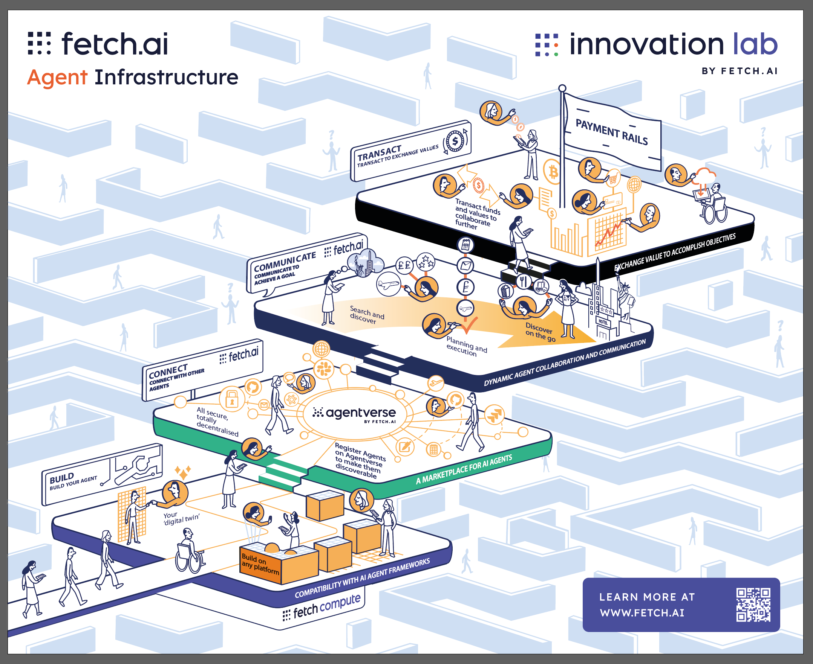
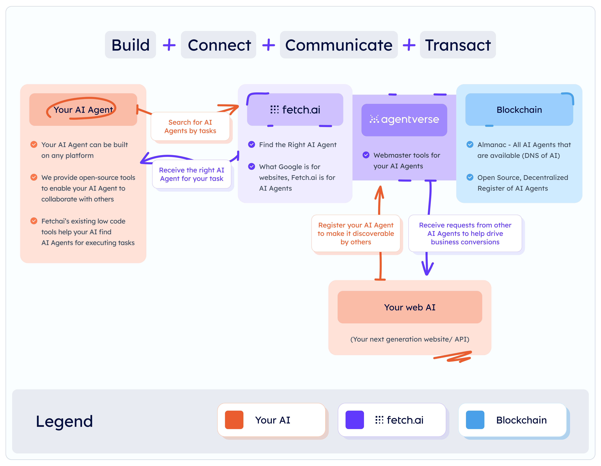

What is Fetch.ai?
=================

Fetch.ai is a platform designed to power the decentralized digital economy with AI-enabled solutions. It enables the creation of autonomous agents—programs that can make decisions and take actions independently on behalf of individuals, businesses, and devices. These agents are the core of Fetch.ai's ecosystem, capable of solving complex problems across various domains such as supply chain optimization, decentralized finance, and data sharing.

With tools like the uAgents framework and Fetch.ai SDK, the platform simplifies the process of building AI agents and connecting them to Agentverse, an open marketplace where agents collaborate to solve problems. By integrating blockchain technology, Fetch.ai ensures secure, decentralized, and transparent interactions, paving the way for a new era of intelligent automation.

How Does It Work?
=================

Core Components
---------------

Fetch.ai's ecosystem revolves around four key principles:

- **Build**: Create intelligent, task-specific agents using the uAgents Framework or other tools.
- **Connect**: Deploy and register agents on Agentverse to discover and collaborate with other agents.
- **Communicate**: Enable agents to exchange secure messages and share data seamlessly.
- **Transact**: Perform decentralized transactions using blockchain to ensure trust, transparency, and accountability.

Below are the core components of the Fetch.ai ecosystem:

- **Agents**: Autonomous/AI Agent programs that make decisions, solve problems, and perform tasks independently.
- **Agentverse**: A marketplace, management, and development hub where agents are created, registered, deployed, and discovered.
- **Fetch Compute**: Decentralized infrastructure for training AI models and performing computational tasks.
- **Almanac Contract**: A blockchain smart contract that helps your agent register on the blockchain and make it discoverable by other agents.

Development Tools
-----------------

- **uAgents Framework**: A lightweight library for creating, deploying, and managing AI agents. This package includes communication and transaction capabilities between agents.
- **Fetch.ai SDK**: A tool for dynamically searching for agents without requiring predefined data models for message exchange. It provides a generalized messaging structure for all types of messages.

How the System Operates
========================

Fetch.ai operates based on four core activities: Build, Connect, Communicate, and Transact.

- **Build**: 
  - Design autonomous agents using the uAgents Framework or SDK.
  - Define task-specific logic and workflows for agents.
  - Example: Build a supply chain agent that monitors shipments in real-time.

- **Connect**:
  - Deploy agents on Agentverse and register them in the Almanac for discoverability.
  - Allow agents to interact with other agents to achieve collaborative goals.
  - Example: Connect an agent with weather forecasting agents to optimize logistics.

- **Communicate**:
  - Exchange secure, blockchain-powered messages between agents.
  - Use Fetch.ai's unified messaging system and protocols to simplify communication.
  - Example: Share stock price updates or IoT data securely.

- **Transact**:
  - Perform blockchain-backed transactions directly between agents through wallets.
  - Ensure secure and trustless execution of smart contracts.
  - Example: Enable a payment agent to execute financial transactions for services rendered.

This structured approach ensures agents remain efficient, scalable, and interoperable across domains.

Use Cases
---------

- **Supply Chain**: Optimizing logistics and monitoring suppliers for improved efficiency.
- **DeFi**: Automating trading, risk management, and financial operations.
- **Data Sharing**: Facilitating secure and decentralized data exchange.
- **Smart Cities**: Enhancing IoT device communication and energy distribution.
- And much more...

How is Fetch.ai/uAgents Different from Other AI Agent Frameworks?
=================================================================

- **Decentralization-First Design**: Unlike many frameworks, Fetch.ai’s uAgents are built with optional decentralization, leveraging blockchain for secure, transparent, and trustless interactions.
- **Agent Marketplace**: Fetch.ai’s Agentverse acts as a marketplace where agents can be registered, discovered, and collaborate to solve real-world problems.
- **Unified Messaging System**: uAgents provide a generalized messaging structure, removing the need to define custom data models for agent communication.
- **Seamless Integration**: uAgents and the Fetch.ai SDK allow for easy integration with APIs, smart contracts, and other AI frameworks like LangChain and Crewai.
- **Lightweight and Scalable**: The uAgents Framework is designed to be lightweight, making it ideal for deploying scalable, task-specific agents.
- **Blockchain-Powered Economy**: Fetch.ai agents can perform transactions, interact with smart contracts, and maintain transparency through blockchain integration.
- **Predefined Templates and Tools**: Fetch.ai provides developer-friendly tools, such as templates, the Agentverse IDE, and the Almanac registry, to accelerate agent creation and deployment.
- **Interoperability**: Agents can interact with multiple frameworks and other decentralized networks, enabling cross-platform collaboration.

Conclusion
==========

Fetch.ai is not just a framework for building AI agents—it’s an ecosystem that combines the power of AI, blockchain, and decentralization to create autonomous, intelligent, and collaborative solutions.

